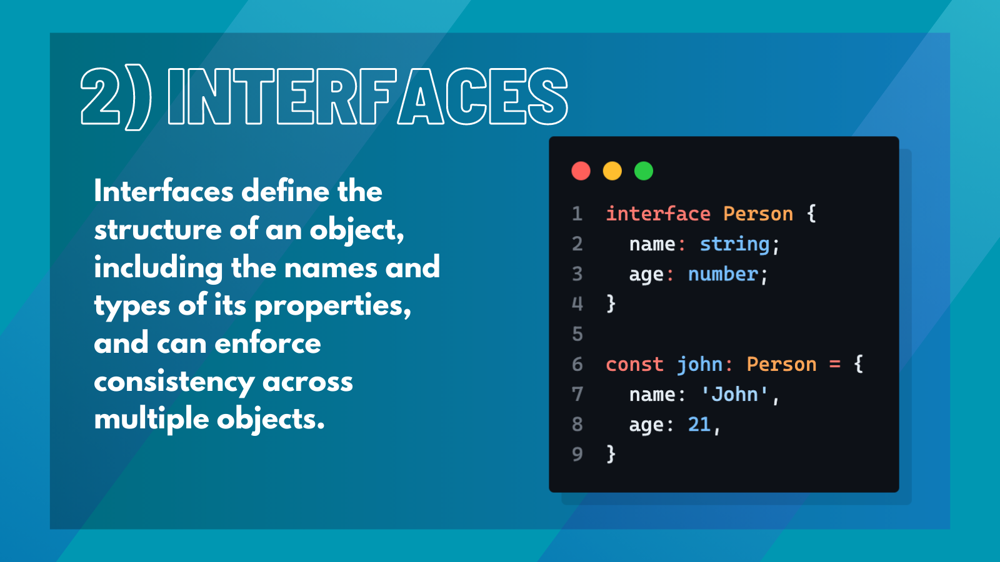

## Introduction

TypeScript is an open-source programming language that is a superset of JavaScript. It adds optional static typing and class-based object-oriented programming to the language. As a result, TypeScript is becoming increasingly popular among developers, especially those working with large-scale projects. In this blog post, we will discuss 10 of the most important TypeScript concepts that every developer should know.


## 1. Type Annotations

Type annotations are a crucial concept in TypeScript. They allow developers to specify the data types of variables, function parameters, and return types. This can help catch errors during development and improve code readability. 

For example, 

```typescript
let age: number = 27; 
```

This specifies that the variable `age` should be of type `number` and have an initial value of `27`.


## 2. Interfaces

Interfaces are used to define the structure of an object. They specify the names and types of the object's properties and can be used to enforce consistency across multiple objects. 

For instance, 
```typescript
interface Person { name: string; age: number; }
``` 
This defines an interface for a `Person` object with a `name` property of type `string` and an `age` property of type `number`.




## 3. Classes

Classes are a core concept in object-oriented programming, and TypeScript has full support for them. Classes allow developers to define blueprints for objects that share the same properties and methods. They can also include constructors, access modifiers, and inheritance. 

For example, 
```typescript
class Animal { 
    name: string; 
    constructor(name: string) { 
        this.name = name; 
    } 
}
``` 
This defines a `Animal` class with a `name` property and a constructor that sets the `name` property.


## 4. Generics

Generics are a powerful feature in TypeScript that allow for the creation of reusable code. They allow developers to create functions and classes that can work with a variety of data types. 

For example, 
```typescript 
function identity<T>(arg: T): T { 
    return arg; 
}
``` 

This defines a generic `identity` function that returns the same value that is passed to it.


## 5. Enums

Enums are a way to define a set of named values. They can improve code readability and help catch errors. 

For instance, 
```typescript
enum Color { 
    Red, Green, Blue 
}
``` 

This defines an `Color` enum with three named values: `Red`, `Green`, and `Blue`. Enum values can also be assigned specific numeric values, such as:
```typescript 
enum Color { 
    Red = 1, 
    Green = 2, 
    Blue = 4 
}
```


## 6. Type Inference

Type inference is a feature of TypeScript that allows developers to omit type annotations in certain situations. 

For example, 
```typescript
let age = 27;
```
This will automatically be inferred as a `number` type because it is assigned a numeric value. Type inference can also be used with function parameters and return types, such as: 

```typescript 
function add(a: number, b: number) { 
    return a + b; 
}
```


## 7. Union and Intersection Types

Union types allow for the combination of two or more data types into one. This can be useful when a function or variable can accept multiple types of data. 

For example, 
```typescript
let age: number | string = 27;
```

This specifies that the `age` variable can be of type `number` or `string`. Intersection types, on the other hand, allow for the creation of a new type that includes all properties and methods of multiple types. 

For example, 

```typescript 
type Animal = Dog & Cat;
``` 

This creates a new type `Animal` that has all properties and methods of both the `Dog` and `Cat` types.


## 8. Type Guards

Type guards are a feature in TypeScript that allow developers to check the type of a variable at runtime. This can be useful when working with union types or other situations where the type of a variable may not be known. 

For instance, 

```typescript
if (typeof age === "number") { 
    console.log(age * 2); 
}
```
This checks if the `age` variable is of type `number` before performing a multiplication operation.


## 9. Decorators

Decorators are a feature in TypeScript that allow for the addition of metadata to classes, methods, and properties. They can be used to modify the behavior of a class or to provide additional information for tools like code analyzers. 

For example, 
```typescript 
@deprecated class MyClass {}
```

This marks the `MyClass` class as deprecated and will generate a warning when used.


## 10. Modules

Modules are a way to organize code into smaller, reusable components. They allow developers to define private and public parts of a codebase and to import and export components between files. 

For example, 

```typescript
// my-class.ts
export class MyClass {}
```

This exports the `MyClass` class from a module, while: 

```typescript 
// main.ts
import { MyClass } from "./MyClass";
``` 

This imports the `MyClass` class into another module.


## Conclusion

TypeScript is a powerful language that is becoming increasingly popular among developers. By mastering these 10 important concepts, developers can write more efficient and maintainable code. While there are many other concepts and features in TypeScript, these 10 are a great starting point for any developer looking to learn the language.

## References

- [TypeScript](https://www.typescriptlang.org/)
- [TypeScript Handbook](https://www.typescriptlang.org/docs/handbook/intro.html)
- [TypeScript Deep Dive](https://basarat.gitbook.io/typescript/)
- [TypeScript in 5 minutes](https://www.typescriptlang.org/docs/handbook/typescript-in-5-minutes.html)
- [TypeScript Playground](https://www.typescriptlang.org/play)