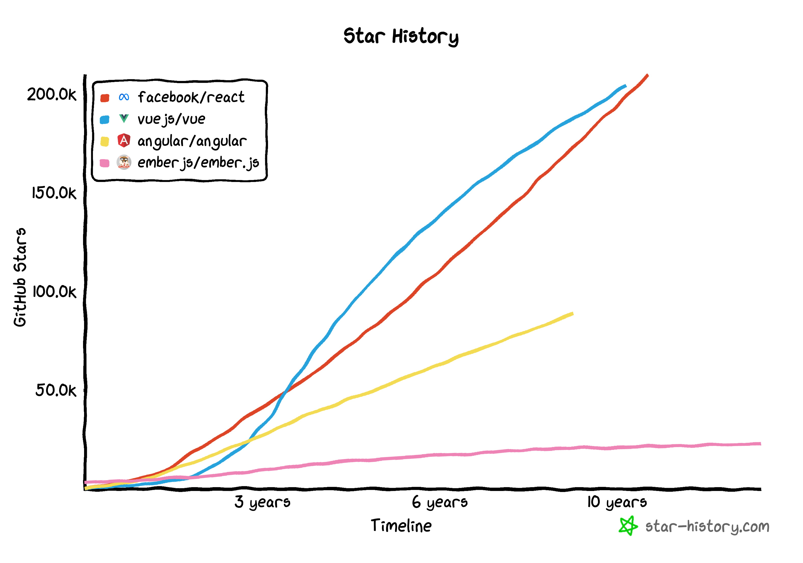
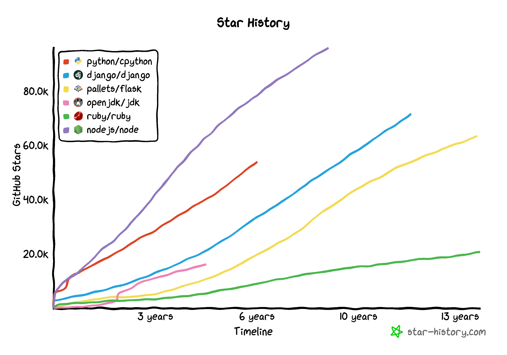
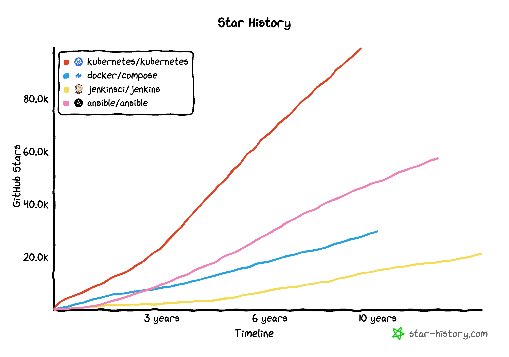
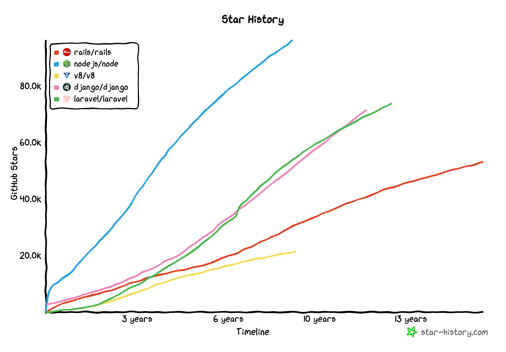
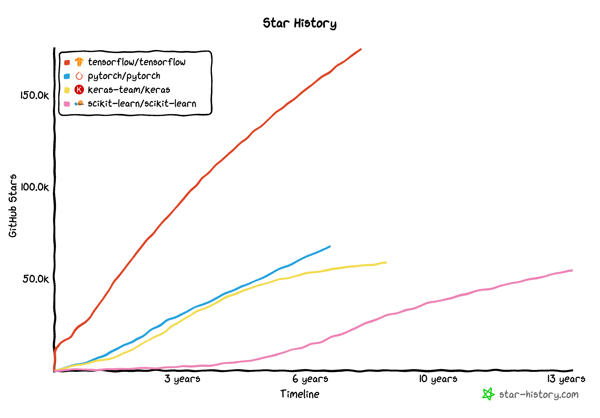
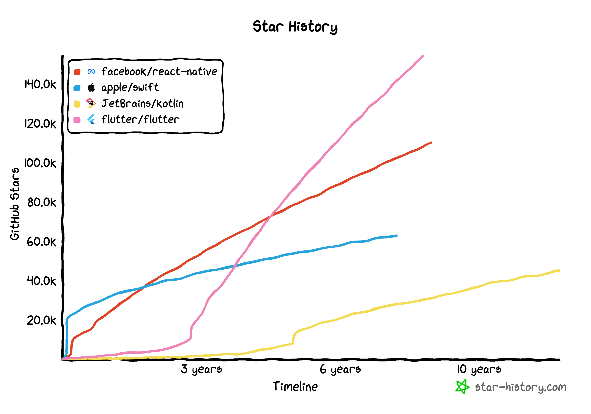
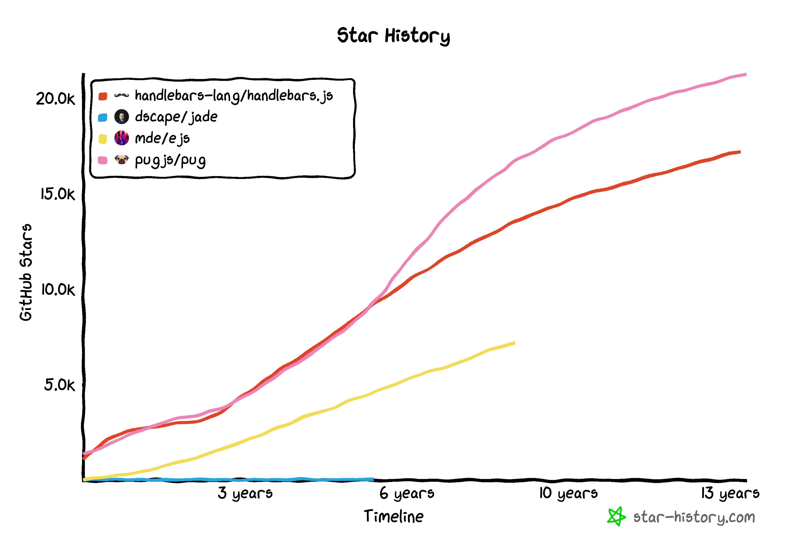

In the world of software development, every technology has a leading [library or framework](https://www.baeldung.com/cs/framework-vs-library). But have you ever wondered what is the leader among the leading libraries? Which technology has the highest number of likes or followers? Github is the best place to investigate and find out such a statistic. In this article, we will look at all the major technologies in various software development streams and explore the most popular libraries and frameworks in each category.

## Frontend Libraries

Frontend development is the process of using HTML, CSS, and JavaScript to create [web applications](https://en.wikipedia.org/wiki/Web_application) that run in a user's web browser. There are many popular frontend libraries available, but the clear leader is [React](https://react.dev/). React is a JavaScript library developed by Facebook that allows developers to create complex and dynamic user interfaces. It has over **209k stars**  (2023) on Github, making it the most popular frontend library by a large margin.

Other popular frontend libraries include Vue.js, Angular, and Ember.js. [Vue.js](https://vuejs.org/) is a progressive JavaScript framework that is gaining popularity due to its simplicity and ease of use. Surprisingly, Vue.js has been more popular than React.js for a long time if you consider the GitHub stars parameter alone. [Angular](https://angular.io/) is a framework developed by Google that is widely used in enterprise applications. [Ember.js](https://emberjs.com/) is a framework that is known for its convention over configuration approach and is used by companies such as Netflix and LinkedIn.

## Backend Language Libraries

Backend development is the process of creating [server-side applications](https://developer.mozilla.org/en-US/docs/Learn/Server-side/First_steps/Introduction) that provide data and services to frontend applications. There are many programming languages that can be used for backend development, and each language has its own set of libraries and frameworks. The most popular backend language is currently Python, and it has a number of popular libraries such as Django and Flask. Although Node.js has the most stars among individual projects, we have to give this category to Python in this category. This is because of its collective stars in the first two popular libraries, among many others.

[Django](https://www.djangoproject.com/) is a high-level Python web framework that enables rapid development of secure and maintainable websites. It has over 71.5k stars on Github and is used by companies such as Instagram and Mozilla. [Flask](https://flask.palletsprojects.com/en/2.3.x/) is a micro web framework that is lightweight and easy to use. It has over 63.3k stars (2023) on Github and is used by companies such as Airbnb and Netflix.

Other popular backend languages include Java, Ruby, and Node.js. [Java](https://www.java.com/en/) is a widely used programming language that is popular in enterprise applications. [Ruby](https://www.ruby-lang.org/en/) is a dynamic, open-source programming language that is used in web development. [Node.js](https://nodejs.org/en) is a JavaScript runtime built on Chrome's V8 JavaScript engine that enables developers to build server-side applications in JavaScript.

## DevOps

DevOps is the practice of combining software development and IT operations to improve the speed and quality of [software delivery](https://softwaresim.com/blog/how-can-devops-improve-software-delivery/). There are many tools and platforms available for DevOps, but the most popular platform by far is [Kubernetes](https://kubernetes.io/). It is an open-source container [orchestration](https://www.redhat.com/en/topics/containers/what-is-container-orchestration) platform that automates the deployment, scaling, and management of containerized applications. Kubernetes has over 99.3k stars (2023) on Github. Kubernetes is used by major companies such as Airbnb, GitHub, and Spotify for container orchestration and deployment automation.

Other popular DevOps tools include Docker, Jenkins, and Ansible. [Docker](https://www.docker.com/) is a platform that allows developers to package applications and their dependencies into containers that can be easily deployed to any environment. [Jenkins](https://www.jenkins.io/) is an open-source automation server that enables developers to automate the building, testing, and deployment of software. [Ansible](https://www.ansible.com/) is an open-source automation tool that enables developers to automate the configuration and management of IT infrastructure.

## Fullstack E2E Solutions

[Fullstack development](https://bootcamp.learn.utoronto.ca/blog/what-is-a-full-stack-developer/) is the process of creating applications that span both frontend and backend development. There are many fullstack frameworks available, but the most popular by far is [Node.js](https://nodejs.org/en). Node.js is a JavaScript runtime built on Chrome's [V8 JavaScript engine](https://v8.dev/) that enables developers to build server-side applications in JavaScript. It has over **96k stars** on Github and is used by companies such as Netflix and LinkedIn.

Other popular fullstack frameworks include Ruby on Rails, Django, and Laravel. [Ruby on Rails](https://rubyonrails.org/) is a popular web application framework that uses the Ruby programming language. [Django](https://www.djangoproject.com/) and [Laravel](https://laravel.com/) are both backend web frameworks that use Python and PHP, respectively.

## Machine Learning

Machine learning is the process of using algorithms and [statistical models](https://en.wikipedia.org/wiki/Statistical_model) to enable computers to learn from data. There are many tools and libraries available for machine learning, but the most popular by far is [TensorFlow](https://www.tensorflow.org/). TensorFlow is an open-source platform for machine learning developed by Google. It has over **176k stars** on Github and is used by companies such as Airbnb and Intel.

Other popular machine learning tools include PyTorch, Keras, and Scikit-learn. [PyTorch](https://pytorch.org/) is an open-source machine learning library developed by Facebook that is known for its ease of use and flexibility. [Keras](https://keras.io/) is a high-level neural networks API that is written in Python and is known for its simplicity. [Scikit-learn](https://scikit-learn.org/stable/) is a machine learning library for Python that is used for data analysis and data mining tasks.

## Mobile App Libraries and Languages

Mobile app development is the process of creating applications for mobile devices such as smartphones and tablets. There are many mobile app libraries and languages available, but the most popular by far is Flutter. [Flutter](https://flutter.dev/) is a mobile app development framework developed by Google that enables developers to build high-performance, high-fidelity, apps for iOS and Android from a single codebase. It has over [154k stars](https://pytorch.org/) on Github.

Other popular mobile app libraries and languages include Swift, Kotlin, and React Native. [Swift](https://developer.apple.com/swift/) is a programming language developed by Apple that is used for iOS and macOS development. [Kotlin](https://kotlinlang.org/) is a programming language developed by JetBrains that is used for Android development. [React Native](https://reactnative.dev/) is a JavaScript framework developed by Facebook that enables developers to build mobile applications for iOS and Android using a single codebase.

## Templating Engines

Templating engines are tools that enable developers to create HTML templates that can be dynamically generated and rendered by web applications. There are many templating engines available, but the most popular by far is Pug. [Pug](https://pugjs.org/api/getting-started.html) is a templating engine that is known for its simplicity and ease of use. It has over 21.3k stars on Github. Airbnb and Node.js use Pug templating engine.

Other popular templating engines include Jade, EJS, and Handlebars. [Jade](https://github.com/dscape/jade) is a high-performance templating engine that is used for server-side rendering. [EJS](https://ejs.co/) is a lightweight templating engine that is used for client-side and server-side rendering. [Handlebars](https://handlebarsjs.com/) is a templating language that is based on the [Mustache template language](https://mustache.github.io/).

## Finally

In conclusion, the popularity of libraries and frameworks varies widely across different technologies and software development streams. However, by examining Github stars and usage by major companies, we can determine which libraries and frameworks are currently the most popular in each category. Although ChatGPT and AI are buzzwords in the software industry these days, it is important to note that a solid history of success and reliability for a tool is equally important. The number of stars on Github is a testament to this. React.js leads the way with **209k stars**, followed closely by Vue.js with 204k stars, and then TensorFlow with 176k stars.

---

If you liked this post, please take a moment to check out my other posts [here](https://tech.nagakonada.com/all-articles).