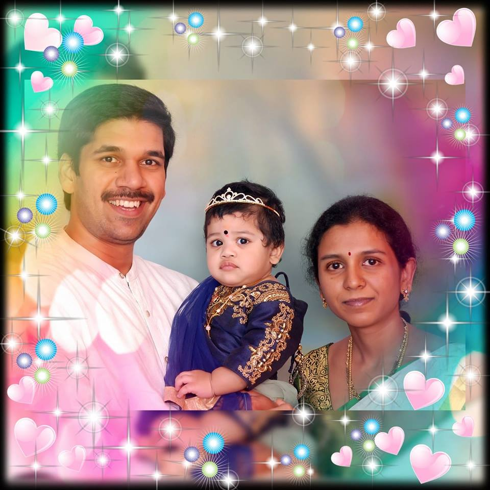

This is my first ever blog post, where I briefly mention my life journey.

<!--truncate-->

## Intro

Hey, how's it going?

In the past, I've often thought that there would never be a day like today in my life.

I feel so much happiness and excitement on one side, but there's also a sense of emptiness on the other. You might be wondering why there's a void. Let me explain.

## The beginning

> We are all humans and we make mistakes. We learn from them, try not to repeat them, but often end up repeating them and falling down like dried leaves of a dying tree.

I come from a small town called [Tuni](https://en.wikipedia.org/wiki/Tuni) on the eastern coast of Andhra Pradesh, India. It feels like a different world when I reminisce on those incredible memories. My thoughts deepen, and my legs feel a chill of nostalgia whenever I recall them.

I studied until my plus-two in that town and then pursued my B.Tech in [Kakinada](https://en.wikipedia.org/wiki/Kakinada), where I met my current ongoing future. The high-tech lifestyle, prospective opportunities, dream-filled faces and more made it a miracle how my life ended up there and eventually here.

The college showed me the path to a technical career, and I got campus-placed in one of the biggest corporate giants in India. I soon joined the office as a rookie in the garden city of India, [Bangalore](https://en.wikipedia.org/wiki/Bangalore).

## The career

> Life is a race, and everyone tries hard to win. But the race is only a part of life, and there are moments that beg you to stop, listen, and cherish.

I got married in the first year of my professional career. I had no plans or complicated strategies for budgeting, planning, and implementing them. I went with my family, as the wind took us.

My knowledge of technologies like Java, JavaScript, CSS, and HTML strengthened, and I grew as a web developer with backend programming experience. I worked on creating e-commerce and sales websites, such as those for large US banks.

I changed cities and companies, this time to [Hyderabad](https://en.wikipedia.org/wiki/Hyderabad), and I worked for one of the biggest mutual fund companies in the US.

In the midst of all the turmoil, I found peace. There were cool people, bundles of joy, and table tennis. In-house projects, cool code releases, scrum meetings, morning coffees, and innovative hackathons were routine. Heaven could have been dull compared to this.

My first child was born, and life slowed down to a graceful, smooth ride. I started feeling the fatherly sense, the love that only a father can have for his family. It's a care that cannot be explained, but must be experienced. I knew the man in me was finally maturing, and it all started making sense.

My career picked up pace, and new technologies swirled all around. People were again trying to catch the wind, and shouts were everywhere. Fancy things started in the office, and funny behaviors and unexpected new friends filled my mind with memories of shouts, cries, hatred, and bromance.

Yet...!!!

That day came, after five years, when I had to say enough is enough. I was a grown-up man who wanted to step up and stand by his family. No more take-it-easy strategy. I resigned.

## The current

My third company is the perfect place for someone like me. It's full of innovative thinking, with a unique communication strategy and open-minded people. There's a huge community of geeks, nerds, and fun-loving individuals.

This is a serious turning point in my career, with cool and energetic things happening every minute. I'm keeping myself busy and productive, all while having fun and working towards my vision.

I don't mean to brag, but this new workplace is the latest and greatest thing to happen to my life and family. My mind has opened up, and I'm no longer missing out on all the cool innovation and fun.

> Life continues.

