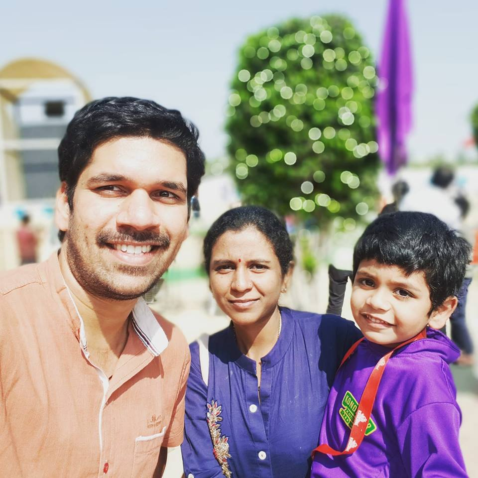

On Monday, January 28th in the morning, I experienced great pain in my lower back towards the left side.

<!--truncate-->

I got up as usual that day, preparing to go to the office. However, as I was brushing my teeth and walking towards the Deewan, I suddenly felt the pain and collapsed onto the Deewan.

It was only after some time had passed that my wife realized the severity of the issue because I generally tend to lay down on the bed for some time before starting the day. I decided to take the day off from work and informed my coworkers about my condition.

## How severe

At one point, I was unable to even get up from the Deewan to go to the washroom. I couldn't even turn around, and had to use my upper body strength to move even slightly.

I stayed still until the afternoon, only getting up to have some food and go to the bathroom once in the middle of the day.

In the evening at 4pm, my wife rushed me to Mythri hospital in Ashok Nagar (Chandanagar) in an Ola Auto. I was admitted in the Out-patient ward and they immediately tested my condition and advised an X-ray test.

The nurse gave me a painkiller injection on my back (ironically, the injection itself was painful), and then I went for the X-Ray. The technician positioned me in front and sideways positions, and after some time, I was moved to the waiting area for the doctor's visit. The doctor arrived at 6pm.

## What happened

This was not a bone fracture or bone-related issue at all. It was a muscle tear issue (muscle got torn near the spine), which generally happens if I do some heavy lifting or heavy work just before that.

However, I did not remember doing anything of that sort. So, this could be due to:

- Bad sleeping posture
- While tongue-cleaning that morning, I might have coughed up waste in a rigorous way that accidentally triggered the muscle tear.
- My elder kid (Tamoghna) sometimes plays on my back, even to the extent of jumping on the lower part when I sleep facing down.
- A combination of all the above along with sitting postures issue at the workplace. However, I highly doubt about the sitting posture, as I take good care of my back during worktime, and I move around quite a lot, especially in my new workplace.

Anyway, we came home after being prescribed some muscle relaxing medicine and Volini pain relief cream. Most importantly, I need bed rest for at least a week.

This was the first time I had such severe pain in the lower back and could not even change my posture in bed for the next 24 hours or so.

I am slowly recovering from the issue, but on the second and third days, for some weird reason, my motions went out of control (went loose), and I went to the bathroom more than 10 times in two days. So, today (30th Jan), we went to the same doctor again to understand if this is due to the prescribed medicines. He gave some other medicine as well.

My wife, funnily told the doctor and the people in the OP room on Monday, all kinds of made-up reasons why I might have got the issue in the first place:

- That I do not eat rice anymore, and so because of an imbalanced diet.
- That I eat a lot of biscuits in an attempt to quench my hunger.
- That I might have an issue with my kidneys due to the diet.
- That I lost too much weight, and so I got this issue.

All the people, including the doctor, dismissed the assumptions. She even suggested the doctor prescribe a kidney check-up during the second visit, but the doctor said there is no need for that.

When the sister checked my BP on Monday, it was 120/80, the first time I noticed the normal BP after all these years. I attribute this normality in BP to the stricter diet and continual jogging sessions that I am doing these days.

So, after the doctor visit on Monday, I decided to give myself some rest this week. I informed the concerned team and took leave from the office.

> Friends, take care of your backs. Do not allow any pressure on your backs while playing with kids or lifting heavy stuff (even kids) and during any daily activity that involves heavy things.

